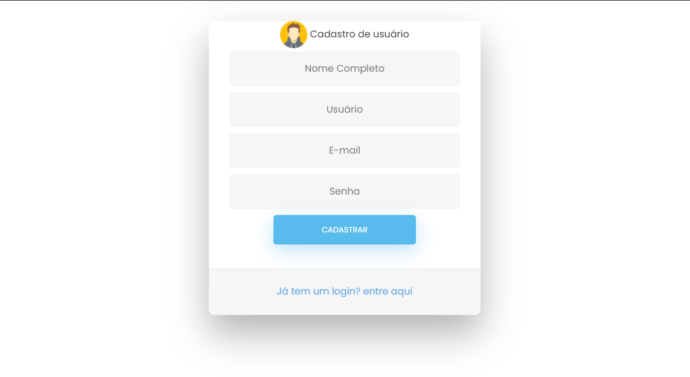
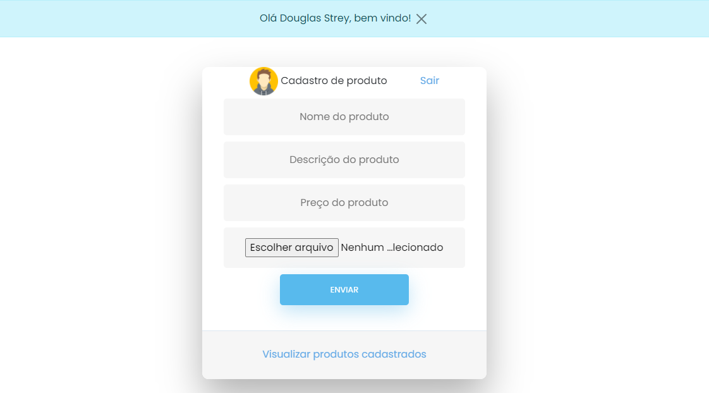

## 🚀 Prints da aplicação

### 🔐 Tela de login

 

### 📝 Tela de cadastro

 

### 🏷 Tela de cadastro de produto

 

## 🚀 Tecnologias

Esse projeto foi desenvolvido com as seguintes tecnologias/libs:

- HTML
- CSS
- JS
- PHP
- Bootstrap v5.0
- Jquery
- Jquery Mask Money
- SweetAlert2

## 💻 Projeto

Projeto realizado no programa de estágio que estou participando, com foco no aprendizado e estudo de bibliotecas e frameworks. No momento estou estudando bootstrap e jquery.

## 🔖 Layout

Por enquando ainda não é possível visualizar o layout do projeto.
<!---Você pode visualizar o layout do projeto inteiro através [desse link](https://edi-store.vercel.app/). -->
